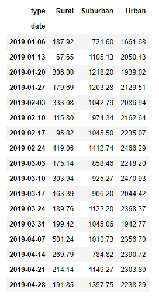
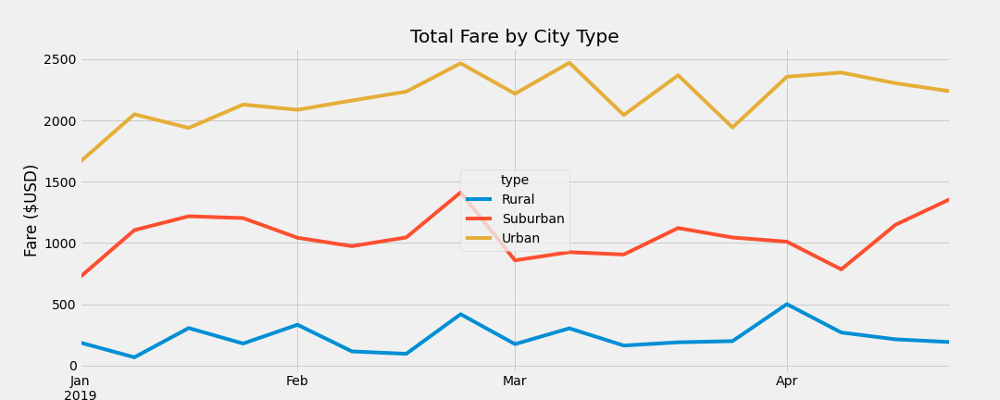
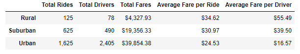

# PyBer_Analysis
## Overview
The purpose of this analysis was to review ridesharing data in order to help Pyber improve its services by showing the relationship between types of cities, the corresponding numbers of drivers and riders using the service, and amounts of revenue made.

## Results
According to the results displayed in the chart and graph below, there is a much higher total fare amount that comes from urban areas than comes from either suburban or rural areas, which appear to be consistent through the time span.

## Summary
It appears that there is a large disparity between urban and rural city types, with suburban cities in between. And although there is more revenue that is being generated in urban cities, as seen on the chart below, it appears that the average fare per driver and fare per ride is lower in urban cities than rural cities, with suburban cities again in between. 

Finding ways to help drivers in urban areas take on more routes in more rural areas as well could perhaps lead to those drivers making more revenue for themselves and their routes. Also trying to expand the number of drivers in rural areas could bring down the average fare per ride, which could end up bringing in more revenue in the long run.
